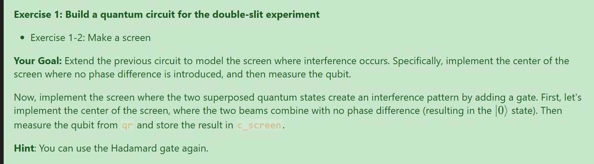

# Quantum & Classical Registry

qr = QuantumRegister(1, name='q')
cr = ClassicalRegister(1, name='c_screen')

## **Understanding the Code**

```python
from qiskit import QuantumRegister, ClassicalRegister

qr = QuantumRegister(1, name='q')
cr = ClassicalRegister(1, name='c_screen')
```

---

### **1. `QuantumRegister(1, name='q')`**

* This creates a **quantum register** — a collection of qubits that can be manipulated as a group.
* `1`: You’re creating a register with **1 qubit**.
* `name='q'`: This assigns the register a name, `"q"`, so when visualized (e.g., via circuit diagrams), it appears labeled.

#### What is a **QuantumRegister**?

* It's a container that holds qubits for use in a quantum circuit.
* In Qiskit, you need to explicitly define quantum registers before creating a `QuantumCircuit`.

---

### **2. `ClassicalRegister(1, name='c_screen')`**

* This creates a **classical register**, which stores the **measurement results** of qubits after they're measured (i.e., collapsed to 0 or 1).
* `1`: You're allocating **1 classical bit** to store the result.
* `name='c_screen'`: This gives the register a readable name, `"c_screen"`.

#### What is a **ClassicalRegister**?

* It's a classical memory location used to store measurement outcomes.
* Quantum computers can't *observe* qubits without collapsing them. When you measure a qubit, the result goes into a classical register.

---

## **Typical Usage in a Quantum Circuit**

Here’s how these would be used together in a circuit:

```python
from qiskit import QuantumCircuit, QuantumRegister, ClassicalRegister

qr = QuantumRegister(1, name='q')
cr = ClassicalRegister(1, name='c_screen')

qc = QuantumCircuit(qr, cr)

qc.h(qr[0])             # Apply Hadamard gate to put qubit into superposition
qc.measure(qr[0], cr[0])  # Measure the qubit and store result in classical register
```

### Output:

This would simulate measuring a qubit that’s in a superposition of 0 and 1 (via the Hadamard gate). The outcome would be randomly either `0` or `1`, and stored in the classical bit `c_screen[0]`.

---

## **Summary**

| Register Type       | Purpose                         | Size | Example Use               |
| ------------------- | ------------------------------- | ---- | ------------------------- |
| `QuantumRegister`   | Holds qubits for quantum ops    | 1    | `qr[0] = qubit`           |
| `ClassicalRegister` | Holds results after measurement | 1    | `cr[0] = result (0 or 1)` |

These components are essential building blocks in Qiskit circuits. You define the quantum and classical registers, then use them in a `QuantumCircuit` to apply gates, perform measurements, and analyze results.


---------------------------------------------------------------------------------------------------------
---------------------------------------------------------------------------------------------------------


# Implicit vs Explicit Registry

Great question — you're comparing **explicit register creation** vs. **implicit register creation** when building a quantum circuit in Qiskit.

Let’s break it down.

---

## 🔹 Code 1 (Explicit Registers)

```python
from qiskit import QuantumRegister, ClassicalRegister, QuantumCircuit

qr = QuantumRegister(1, name='q')
cr = ClassicalRegister(1, name='c_screen')
qc = QuantumCircuit(qr, cr)
```

### This approach:

* **Explicitly defines** a quantum register and a classical register.
* Gives you full control over naming and sizing.
* Useful when you want **multiple registers**, or want to **label registers** clearly for clarity or debugging.
* You'll access qubits as `qr[0]` and classical bits as `cr[0]`.

---

## 🔹 Code 2 (Implicit Register)

```python
qc = QuantumCircuit(3)

qc.h(0)
qc.cx(0, 1)
qc.cx(1, 2)
```

### This approach:

* Creates **only a quantum circuit with 3 qubits**, implicitly.
* You don’t define the registers yourself — Qiskit does it under the hood.
* This is **faster and simpler** for small circuits or exercises where measurement isn’t the focus.
* There is **no classical register**, so you cannot do measurements unless you add one later with `qc.measure_all()` or `qc.add_register()`.

---

## ✅ Key Differences

| Feature                    | Explicit Registers                                  | Implicit Registers                       |
| -------------------------- | --------------------------------------------------- | ---------------------------------------- |
| Register Declaration       | Manual (`QuantumRegister`, `ClassicalRegister`)     | Automatic when using `QuantumCircuit(n)` |
| Register Naming            | You choose names (`'q'`, `'c_screen'`)              | Default naming (`q_0`, `q_1`, etc.)      |
| Classical Register Support | Included if you define it                           | Not included unless you add it           |
| Use Case                   | Precise control, advanced usage, multiple registers | Simpler circuits, fast prototyping       |
| Measurement Possible?      | Yes (if you define classical register)              | No (unless you add classical bits later) |
| Code Simplicity            | Slightly more verbose                               | More compact                             |

---

## 🧠 When Should You Use Each?

* **Use explicit registers** when:

  * You’re building modular or reusable circuits.
  * You need named registers for debugging, visualization, or interfacing with other tools.
  * You plan to measure and analyze results.

* **Use implicit circuits** when:

  * You’re doing small exercises or learning gates.
  * You’re simulating pure unitary evolution with no measurements.
  * You just want to try out a quick sequence of gates.

---

## ✅ BONUS: Making the Implicit Circuit Measurable

If you want to **measure all qubits** in your implicit circuit:

```python
qc.measure_all()
```

Or add a classical register explicitly:

```python
qc.add_register(ClassicalRegister(3))
qc.measure(0, 0)
qc.measure(1, 1)
qc.measure(2, 2)
```
---
---------------------------------------------------------------------------------------------------------
---------------------------------------------------------------------------------------------------------

# Referencing Qubits in Qiskit Register

Excellent question — this is about two different ways to **refer to qubits in Qiskit**. Both are valid, but they differ slightly in style and what they assume.

---

## 🔍 Let's say you have this:

```python
qr = QuantumRegister(1, name='q')
cr = ClassicalRegister(1, name='c_screen')
double_slit_with_difference = QuantumCircuit(qr, cr)
```

Now you can apply gates in two ways:

---

## ✅ 1. **By Index Only (e.g., `h(0)`)**

```python
double_slit_with_difference.h(0)
```

This means:

* “Apply a Hadamard gate to **qubit 0** of the circuit.”
* **It assumes the qubit at index 0**, regardless of what register it's from.

### When is this okay?

* When you only have **one quantum register**, and it's the **first argument** to the circuit.
* It’s shorthand for `double_slit_with_difference.h(qr[0])`.

---

## ✅ 2. **By Register Reference (e.g., `h(qr[0])`)**

```python
double_slit_with_difference.h(qr[0])
```

This means:

* “Apply Hadamard to the **first qubit in register `qr`**.”
* It’s more **explicit** and helps when:

  * You have **multiple quantum registers**
  * You want to be more **clear and readable**

---

## 🎯 Summary Table

| Form       | Meaning                             | When to Use                                        |
| ---------- | ----------------------------------- | -------------------------------------------------- |
| `h(0)`     | Qubit at index 0 (default register) | OK for small, single-register circuits             |
| `h(qr[0])` | Qubit 0 from register `qr`          | Recommended when using named or multiple registers |

---

## ⚠️ Caution

If you have more than one quantum register (e.g., entangling qubits across different registers), using `h(0)` could be ambiguous or even **incorrect** — because index 0 could refer to a different qubit depending on context.

---

## ✅ Best Practice

Even though `h(0)` works in simple examples:

> For clarity, robustness, and compatibility with more complex circuits, it's better to use **explicit register references** like `h(qr[0])`.


---------------------------------------------------------------------------------------------------------
---------------------------------------------------------------------------------------------------------


# Measurement with Quantum computers vs Simulated measurement with classical computers

You're absolutely right to focus in on this subtle but crucial distinction. Let's clarify:

---

## 🧩 What Happens When You Measure a Qubit?

* **In a quantum computer**: When a **qubit is measured**, its **superposition collapses** into a classical value — either `0` or `1`.
* This is a **physical and probabilistic process** governed by the **Born rule** in quantum mechanics.
* The result is **irreversible** — once you measure a qubit, the quantum state is destroyed (collapsed), and all that remains is a classical bit.

---

## ✅ So what about **classical computers** simulating quantum computers?

### **Important distinction**:

> **Classical computers cannot truly "measure" a qubit — because they aren't actually manipulating qubits in the physical quantum sense.**

Instead:

### Classical simulation ≠ Physical quantum measurement

* Classical simulators (like Qiskit Aer, QuTiP, etc.) are **emulating the *mathematical effect*** of quantum measurement.
* They maintain a data structure (e.g., a complex vector of amplitudes) that represents the qubit's state.
* When you call `.measure()` in code:

  * The simulator **samples** from the probability distribution implied by the amplitudes.
  * It then **collapses the simulated state** accordingly — just as a real quantum system would.
  * But this is **not** a physical collapse — it's an **algorithmic collapse** based on rules we’ve programmed in.

---

## 🔍 Analogy

* **Quantum computer**: You open Schrödinger's box and the cat *actually dies or lives*. That *event* is a physical measurement and collapse.
* **Classical simulation**: You roll a weighted die behind the scenes and pretend the box had a cat that lived or died — you simulate the outcome based on the math.

---

## Summary

| Property                      | Quantum Computer                          | Classical Simulation                              |
| ----------------------------- | ----------------------------------------- | ------------------------------------------------- |
| Measurement causes collapse   | Yes (real physical process)               | No (just simulates collapse mathematically)       |
| Result stored                 | In classical registers (hardware bits)    | In data structures (RAM, variables, etc.)         |
| Is the collapse real?         | Yes, irreversible                         | No, just numerical/symbolic behavior              |
| Purpose of classical register | Records the outcome of a real measurement | Mimics this process for analysis or visualization |

---

So to answer your implied question:

> **Do classical computers collapse qubits when measuring?**

**No — classical computers do not physically collapse qubits.**
They simulate the collapse behavior by sampling from a probability distribution and updating their internal state accordingly.


## Stimulating double slit experiment



The exercise is asking you to **complete a quantum circuit that simulates the "screen" of a double-slit experiment**, where interference can be observed.

Let’s walk through what it means and what you need to do:

---

## 🎯 **Your Goal**

Simulate the **center of the screen** in a quantum double-slit experiment. This is the point where:

* **Two quantum paths interfere** constructively (no phase difference).
* The quantum state returns to `|0⟩` with **certainty**, if the interference is perfect.

---

## 🔍 **What’s Happening Physically**

In the real-world double-slit experiment:

* A particle passes through both slits as a quantum wave.
* It interferes with itself.
* A screen detects where the particle lands, showing an interference pattern.

In this circuit:

* You're mimicking this behavior using **quantum gates**.
* The **Hadamard gate** (`H`) acts like a "slit": it puts the qubit into a superposition.
* A **second Hadamard gate** acts like the screen, recombining the paths (just like the waves recombine at the detection screen).

---

## ✅ **Steps to Implement**

### Starting Code:

```python
qr = QuantumRegister(1, name='q')
cr = ClassicalRegister(1, name='c_screen')

double_slit = QuantumCircuit(qr, cr)
double_slit.h(qr[0])  # This represents the double-slit creating superposition
```

### Your Task (per exercise instructions):

1. **Add another Hadamard gate** to simulate the "center of the screen".

   * This represents the recombination of paths (interference).
2. **Measure the qubit** and store the result in `c_screen`.

---

## 🧠 Why Use Two Hadamards?

The Hadamard gate does this:

* `|0⟩ → (|0⟩ + |1⟩)/√2` (creates a 50-50 superposition)
* If you apply it **again**, it reverses that:

  * `(H)(H)|0⟩ = |0⟩`

So if **no phase shift** occurs (i.e., constructive interference), the second Hadamard will collapse it back to `|0⟩` with **100% certainty**.

---

## ✅ Final Code:

```python
qr = QuantumRegister(1, name='q')
cr = ClassicalRegister(1, name='c_screen')

double_slit = QuantumCircuit(qr, cr)

double_slit.h(qr[0])       # Step 1: create superposition (like going through both slits)
double_slit.h(qr[0])       # Step 2: recombine paths (interference at center of screen)
double_slit.measure(qr[0], cr[0])  # Step 3: measure the qubit and store result in c_screen
```

If you run this multiple times, you’ll always get `0` — simulating constructive interference at the center of the screen.

---
---------------------------------------------------------------------------------------------------------
---------------------------------------------------------------------------------------------------------


# Retrieving Results from QuantumCircuit

---

## 🧪 What This Is About

You're checking **the result of your quantum circuit** — specifically, whether the qubit ends up in the `|0⟩` state when it hits the "screen" in your double-slit simulation.

You're using **Qiskit’s SamplerV2**, which lets you simulate and retrieve the **measurement results** (like a histogram of how often you get `0` vs `1`).

---

## 🧠 What You Need to Know

When you run a quantum circuit and **measure a qubit**, Qiskit stores the outcome in a **classical register** (kind of like memory).

But **how you defined that classical register** determines **where to look** for the result.

---

## 🧾 Summary of Key Points

### 1. **If you named your classical register**:

Like this:

```python
cr = ClassicalRegister(1, name='c_screen')
qc = QuantumCircuit(qr, cr)
qc.measure(qr[0], cr[0])
```

Then when you want to get the results:

```python
counts = result[0].data.c_screen.get_counts()
```

You **must use the name** `c_screen` to access the measurement data.

---

### 2. **If you used `.measure_all()`**:

If you didn’t define any classical register yourself and instead wrote:

```python
qc.measure_all()
```

Qiskit gives the output data a default name: `"meas"`, so you would retrieve the result with:

```python
counts = result[0].data.meas.get_counts()
```

---

### 3. **If you used unnamed classical bits**:

If you created a circuit like this:

```python
qc = QuantumCircuit(1, 1)
qc.measure(0, 0)
```

You didn’t name the classical register, so Qiskit will automatically assign default names like `c0`, `c`, etc. In that case:

```python
counts = result[0].data.c0.get_counts()
```

(You’ll need to check what name Qiskit assigned.)

---

## ✅ Final Takeaway

To get your measurement results when using `SamplerV2`, you **must match how you originally set up the classical register**:

| How You Defined Classical Register           | How to Access Result                               |
| -------------------------------------------- | -------------------------------------------------- |
| `cr = ClassicalRegister(1, name='c_screen')` | `result[0].data.c_screen.get_counts()`             |
| `qc.measure_all()`                           | `result[0].data.meas.get_counts()`                 |
| `QuantumCircuit(1, 1)` + `qc.measure(0, 0)`  | Likely `result[0].data.c0.get_counts()` or similar |

If you’re not sure what name was assigned, use `print(result[0].data)` to inspect the structure.

---------------------------------------------------------------------------------------------------------
---------------------------------------------------------------------------------------------------------

# Quantum Compiler

Absolutely! This code runs your **quantum double-slit circuit** on a **simulator**, retrieves the **measurement results**, and then plots them as a distribution (e.g., how often you saw `0` or `1`).

Let’s break this down step by step:

---

## 🧩 LINE-BY-LINE EXPLANATION

### \`\`\`python

backend = AerSimulator()

````

- This initializes an **ideal quantum simulator** (from Qiskit's Aer module).
- It's like a virtual quantum computer that simulates perfect quantum behavior with no noise or decoherence.

---

### ```python
pm = generate_preset_pass_manager(backend=backend, optimization_level=3)
````

* This creates a **pass manager**: a set of compiler steps that **optimize** your circuit before running it.
* `optimization_level=3` means "optimize aggressively" — it will try to reduce gate count, depth, etc., to improve performance.
* The pass manager adapts your circuit to suit the target backend (in this case, the simulator).

---

### \`\`\`python

qc\_isa = pm.run(double\_slit)

````

- This **applies the optimization** to your circuit (`double_slit`) and creates a new, optimized version called `qc_isa`.
- You can think of this as "compiling the circuit for the simulator."

---

### ```python
sampler = Sampler(mode=backend)
````

* This creates a **Sampler** object that will run circuits on the given backend (the simulator in this case).
* `Sampler` is part of Qiskit's **Primitives API**, which simplifies how you run and interpret circuits.

---

### \`\`\`python

counts = sampler.run(\[qc\_isa], shots=1000).result()\[0].data.c\_screen.get\_counts()

````

- This line runs the compiled circuit (`qc_isa`) on the simulator.
- `shots=1000` means: run the circuit **1000 times** to gather statistics (because measurement is probabilistic).
- `.result()[0]`: Get the result of the first (and only) circuit.
- `.data.c_screen.get_counts()`:
  - Since you named your classical register `c_screen`, this retrieves the **counts (histogram)** of how many times each result (like `0` or `1`) was measured.

    For example:
    ```python
    {'0': 1000}  # means you got 0 every time (perfect constructive interference)
    ```

---

### ```python
plot_distribution(counts)
````

* This displays a **bar chart** of the measurement results using Qiskit’s visualization tools.
* If your quantum circuit is working as expected (like the double Hadamard case), the chart should show:

  * **100% probability of `0`**, and
  * **0% for `1`**

---

## ✅ Summary

| Step                             | Purpose                                                         |
| -------------------------------- | --------------------------------------------------------------- |
| `AerSimulator()`                 | Use a noise-free quantum simulator                              |
| `generate_preset_pass_manager()` | Optimize circuit for simulator                                  |
| `pm.run()`                       | Compile and optimize your quantum circuit                       |
| `Sampler()`                      | Set up for running the circuit and retrieving measurement stats |
| `run(..., shots=1000)`           | Run the experiment 1000 times                                   |
| `get_counts()`                   | Get the histogram of results (how often you got 0 or 1)         |
| `plot_distribution()`            | Show the result in a visual, easy-to-understand chart           |

---

Q: Is this similar to compiled programming language where the code is being translated to machine code.

Yes — that’s a **great analogy.**

When Qiskit uses a **pass manager** to optimize a quantum circuit before sending it to a backend (like a simulator or real quantum device), it's **very similar in spirit** to how compiled programming languages (like C or Rust) translate high-level code into machine code.

Let’s compare them side by side:

---

## 🧠 **Quantum Compilation (Qiskit Pass Manager)**

* Your input: high-level **quantum logic gates** (like `H`, `CX`, `measure`).
* The pass manager:

  * **Optimizes** the circuit (removes redundant gates, minimizes depth, reorders operations).
  * **Translates** the circuit into the **gate set supported by the backend** (e.g., IBM hardware only supports specific gates).
  * **Maps logical qubits** to physical qubits on the device.
* Output: a low-level, **hardware-executable** version of your circuit.

This process is sometimes called **quantum transpilation**.

---

## 🖥️ **Classical Compilation (e.g., C → x86)**

* Your input: high-level code (`int x = 5;`).
* The compiler:

  * **Optimizes** the code (removes unused variables, inlines functions, etc.).
  * **Translates** it to **machine instructions** (e.g., `MOV`, `ADD`, etc.).
  * **Targets a specific architecture** (e.g., x86, ARM).
* Output: a binary file or executable — code the CPU can directly run.

---

## ✅ Similarities

| Feature                     | Classical Compilation                        | Quantum Transpilation (Qiskit)                 |
| --------------------------- | -------------------------------------------- | ---------------------------------------------- |
| Optimization                | Yes (e.g., loop unrolling, constant folding) | Yes (e.g., gate cancellation, depth reduction) |
| Target-specific translation | x86 vs ARM                                   | IBM gate set vs IonQ vs simulator              |
| Backend awareness           | Targets CPU/GPU architecture                 | Targets quantum device constraints             |
| Mapping logical to physical | Registers, memory addresses                  | Qubits, connectivity constraints               |

---

## ❗ Difference

* Classical compilation outputs **machine code** (bits to run on silicon).
* Quantum transpilation outputs a **lower-level circuit** still expressed in logical gates — but now **compatible with a real or simulated quantum backend**.

Quantum computers **don’t yet have a stable "machine code" abstraction** like CPUs do (though intermediate representations like OpenQASM and QIR are steps in that direction).

---

## 🧩 Bottom Line

> Yes — Qiskit’s pass manager **is conceptually similar to a classical compiler**. It transforms and optimizes your high-level quantum logic so it can run efficiently on real quantum hardware or simulators.

---------------------------------------------------------------------------------------------------------
---------------------------------------------------------------------------------------------------------

# Qiskit Primitives API?

Great — let’s dive deeper into **Qiskit’s Primitives API**, especially the `Sampler`, and how it compares to previous (legacy) methods in Qiskit.

---

## 🧠 What is the Qiskit Primitives API?

The **Primitives API** is a **newer, high-level interface** in Qiskit designed to make it easier to:

* **Run quantum circuits**
* **Access measurement results**
* **Do expectation value estimation** (for variational algorithms, QML, etc.)
* **Work seamlessly across simulators and real hardware**

This API abstracts away many backend-specific details, so you can focus on **what** you want to compute, not **how** it’s done under the hood.

---

## 🎯 Why Was It Introduced?

Previously, to run a circuit, you had to:

1. Assemble the circuit
2. Bind parameters
3. Submit a job to a backend
4. Wait for the job to complete
5. Manually parse measurement results or expectation values

This was low-level, verbose, and backend-dependent.

The **Primitives API** simplifies this by giving you **ready-to-use tools** like:

* `Sampler` — for measurement sampling (get distributions like `{'0': 500, '1': 500}`)
* `Estimator` — for computing expectation values (like ⟨Z⟩ or ⟨X⟩)

---

## 🔹 `Sampler`: What It Does

The `Sampler` primitive:

* Runs one or more circuits
* Repeats the measurement (based on `shots`)
* Returns a **probability distribution** over measurement outcomes

### Example:

```python
sampler = Sampler()
job = sampler.run([circuit], shots=1000)
result = job.result()
counts = result[0].data.get_counts()
```

This replaces the older `backend.run(...)` + manual result parsing.

---

## 🔹 `Estimator`: What It Does

* Estimates the **expectation value** of an observable (e.g., Z, X, or tensor products like Z ⊗ I ⊗ X).
* Useful for **variational quantum algorithms (VQE, QAOA)** and quantum ML.

### Example:

```python
estimator = Estimator()
value = estimator.run([circuit], observables=[SparsePauliOp('Z')]).result().values[0]
```

You don’t need to manually measure and calculate weighted sums — it’s done for you.

---

## ✅ Benefits of Primitives API

| Feature           | Legacy Approach               | Primitives API              |
| ----------------- | ----------------------------- | --------------------------- |
| Simplicity        | Manual backend jobs + parsing | One-liner `run()` calls     |
| Portability       | Backend-specific              | Backend-agnostic            |
| Performance       | Hard to optimize              | Optimized execution paths   |
| Parameter Binding | Manual                        | Handled internally          |
| Flexibility       | Requires boilerplate code     | Cleaner, declarative syntax |

---

## ⚙️ Backend Modes

When you do:

```python
Sampler(mode=backend)
```

You’re telling the `Sampler` to:

* Use the **backend you specify** (e.g., `AerSimulator`, `FakeBackend`, or real IBM hardware)
* Internally apply **transpilation**, **execution**, and **result parsing** — all handled for you.

---

## 🧪 Example Use Case: Double-Slit Circuit

```python
sampler = Sampler(mode=AerSimulator())
job = sampler.run([my_circuit], shots=1000)
result = job.result()
counts = result[0].data.c_screen.get_counts()
```

This gives you the **output histogram** of how often the qubit collapsed to `0` or `1`.

---

## 📦 Key Primitives

| Primitive          | Purpose                                                  |
| ------------------ | -------------------------------------------------------- |
| `Sampler`          | Run circuits and collect measurement counts (histograms) |
| `Estimator`        | Estimate expectation values of observables               |
| `BackendEstimator` | Backend-specific version of Estimator                    |
| `BackendSampler`   | Backend-specific version of Sampler                      |

These are all part of **Qiskit’s next-gen runtime interface**, aimed at **future-proofing** for:

* Variational algorithms
* Quantum machine learning
* Real-time hybrid quantum-classical workflows

---

## ✅ TL;DR

The **Primitives API** is a modern, simplified way to run and interpret quantum circuits.

* `Sampler` helps you **simulate or execute circuits and get measurement results easily**
* It reduces boilerplate, hides backend complexity, and integrates smoothly with IBM Q hardware and simulators
* Ideal for beginners and advanced users alike

---------------------------------------------------------------------------------------------------------
---------------------------------------------------------------------------------------------------------

# Shots = 1000

Absolutely — let's unpack what `shots = 1000` really means in a quantum simulation or quantum experiment.

---

## 🧨 What Does `shots=1000` Mean?

In Qiskit (and in quantum computing in general), **"shots"** refers to the number of **times a quantum circuit is run** — from beginning to end — in order to collect **statistics from measurements**.

> **Each "shot" is one full run of the circuit that ends in a measurement.**

---

## 🎯 Why Do We Need Multiple Shots?

Because quantum measurements are **probabilistic**.

For example:

```python
qc.h(0)
qc.measure(0, 0)
```

* This circuit puts the qubit into a **superposition**:
  `|0⟩ → (|0⟩ + |1⟩) / √2`
* Measuring it will yield:

  * `0` **50% of the time**
  * `1` **50% of the time**

But if you only run it **once** (1 shot), you’ll get either a `0` or `1` — and that single result doesn’t tell you the **probability distribution**.

To estimate the **true quantum behavior**, you need to:

* Run it **many times** (e.g., `shots=1000`)
* Count how often each result occurs
* Use those counts to **estimate probabilities**

---

## 📊 Example

If you simulate a Hadamard gate with `shots = 1000`:

```python
{'0': 504, '1': 496}
```

That’s **roughly 50/50**, as expected.

If you only ran it once:

```python
{'1': 1}
```

You'd have no idea the state was a superposition. It would look deterministic.

---

## 🔁 Analogy: Rolling a Weighted Die

* Imagine a **weird die** that comes up:

  * 1 half the time
  * 2 the other half

You can't know that by rolling it once. You roll it 1000 times, and now you see:

```python
{1: 502, 2: 498}
```

That tells you the underlying **probability distribution**.
Quantum measurement works the same way.

---

## 🧪 In Quantum Hardware

On **real quantum computers**, "shots" are physical — each shot is a **real pulse sequence** sent to qubits, which are then measured.

* Real devices are noisy — so `shots=1000` also helps **average out the noise**.
* Many variational algorithms use **many shots per iteration** to estimate gradients or expectation values.

---

## 🧾 Summary Table

| Term         | Meaning                                                    |
| ------------ | ---------------------------------------------------------- |
| `shots=1`    | Run the circuit once; one measurement result               |
| `shots=1000` | Run the circuit 1000 times; collect statistics             |
| Why needed?  | Quantum outcomes are probabilistic — need sampling         |
| Result type  | A histogram of how often each measurement outcome occurred |

---

## ✅ TL;DR

Setting `shots = 1000` means:

* Run the same quantum circuit 1000 times
* Each time, measure the qubit(s)
* Count the results to estimate the **probability distribution**
* More shots = better statistical accuracy

---------------------------------------------------------------------------------------------------------
---------------------------------------------------------------------------------------------------------


# Qubit Gates

Absolutely — you’re asking about the **Hadamard gate**, one of the most fundamental quantum gates. Let’s break it down, then look at **other major gates** you'll work with in quantum computing.

---

## 🎯 What is the **Hadamard Gate (H)**?

The **Hadamard gate**, or `H` gate, is a single-qubit gate that creates **superposition** — the uniquely quantum feature where a qubit can be in a combination of `|0⟩` and `|1⟩` at the same time.

### **Matrix Form**:

$$
H = \frac{1}{\sqrt{2}} \begin{bmatrix} 1 & 1 \\ 1 & -1 \end{bmatrix}
$$

---

### **What it does to basis states**:

| Input | Output |    |      |                                                |
| ----- | ------ | -- | ---- | ---------------------------------------------- |
| \`    | 0⟩\`   | (( | 0⟩ + | 1⟩)/\sqrt{2}) → equal superposition            |
| \`    | 1⟩\`   | (( | 0⟩ - | 1⟩)/\sqrt{2}) → equal superposition with phase |

This is like **splitting a photon** at a beam splitter: half goes one way, half the other — perfectly balanced.

---

### **Reversibility**:

Applying `H` twice brings you back:

$$
H(H|0⟩) = |0⟩,\quad H(H|1⟩) = |1⟩
$$

So it’s like a **mirror that flips and unflips** quantum states.

---

## 🧱 Other Important Quantum Gates

Let’s divide them into categories:

---

### 🧩 **Single-Qubit Gates**

| Gate   | Matrix                                              | Description                      |       |
| ------ | --------------------------------------------------- | -------------------------------- | ----- |
| `I`    | $\begin{bmatrix}1 & 0\\0 & 1\end{bmatrix}$          | Identity (does nothing)          |       |
| `X`    | $\begin{bmatrix}0 & 1\\1 & 0\end{bmatrix}$          | Pauli-X (quantum NOT)            |       |
| `Y`    | $\begin{bmatrix}0 & -i\\i & 0\end{bmatrix}$         | Pauli-Y (rotation + phase)       |       |
| `Z`    | $\begin{bmatrix}1 & 0\\0 & -1\end{bmatrix}$         | Pauli-Z (flips phase of \`       | 1⟩\`) |
| `H`    | See above                                           | Hadamard — creates superposition |       |
| `S`    | $\begin{bmatrix}1 & 0\\0 & i\end{bmatrix}$          | Phase gate — adds π/2 to \`      | 1⟩\`  |
| `T`    | $\begin{bmatrix}1 & 0\\0 & e^{i\pi/4}\end{bmatrix}$ | π/4 phase shift                  |       |
| `P(θ)` | $\begin{bmatrix}1 & 0\\0 & e^{iθ}\end{bmatrix}$     | General phase shift              |       |

---

### 🔄 **Rotation Gates**

| Gate    | Axis | Matrix form           |
| ------- | ---- | --------------------- |
| `Rx(θ)` | X    | Rotates around X-axis |
| `Ry(θ)` | Y    | Rotates around Y-axis |
| `Rz(θ)` | Z    | Rotates around Z-axis |

These are used to **fine-tune** a qubit's position on the Bloch Sphere.

---

### 🔗 **Two-Qubit Gates**

| Gate          | Description                                 |      |
| ------------- | ------------------------------------------- | ---- |
| `CX` / `CNOT` | Controlled-X: flips target if control is \` | 1⟩\` |
| `CZ`          | Controlled-Z: flips phase if control is \`  | 1⟩\` |
| `SWAP`        | Swaps two qubit states                      |      |
| `iSWAP`       | Like SWAP, but adds a phase                 |      |

These are critical for **entangling** qubits.

---

### 🧠 **Multi-Qubit / Parametric Gates**

| Gate            | Description                                          |
| --------------- | ---------------------------------------------------- |
| `CCX` (Toffoli) | 2 controls, 1 target — universal for classical logic |
| `U(θ, φ, λ)`    | Generic single-qubit unitary                         |
| `CP(θ)`         | Controlled phase gate                                |

---

## 📈 Visualizing the Hadamard Gate

On the **Bloch sphere**, the `H` gate takes:

* `|0⟩` (pointing up) → to +X axis (equator)
* `|1⟩` (pointing down) → to -X axis

So it's like turning a coin from **heads** to **spinning in the air** — it’s now in an ambiguous state until measured.

---

## ✅ Summary

| Gate               | Function                                     |
| ------------------ | -------------------------------------------- |
| `H`                | Creates superposition (like a beam splitter) |
| `X`, `Y`, `Z`      | Pauli gates — bit/phase flips                |
| `S`, `T`, `P`      | Phase shift gates                            |
| `Rx`, `Ry`, `Rz`   | Rotations around axes                        |
| `CX`, `CZ`         | Entangling operations                        |
| `U`, `CCX`, `SWAP` | Custom/logic gate constructions              |

---------------------------------------------------------------------------------------------------------
---------------------------------------------------------------------------------------------------------


# QuantumCircuit .p vs .s

Fantastic question — you're asking why the code uses:

```python
double_slit_param.p(phi, qr[0])
```

instead of:

```python
double_slit_param.s(qr[0])
```

Let’s break it down clearly.

---

## 🧠 Short Answer:

* `**.p(phi, qr[0])**` is a **general, parameterized phase gate**.
* `**.s(qr[0])**` is a **fixed phase gate** with an angle of **π/2**.

So if you want to **sweep the phase angle** — like in a double-slit experiment — you need `p(φ)`.
If you want to **hardcode a π/2 phase shift**, then `s()` is fine.

---

## ✅ Full Breakdown

### 1. `p(φ)` — **Phase gate with a variable angle**

```python
from qiskit.circuit import Parameter
phi = Parameter('φ')
qc.p(phi, qr[0])
```

* This applies the unitary:

  $$
  P(ϕ) = \begin{bmatrix} 1 & 0 \\ 0 & e^{iϕ} \end{bmatrix}
  $$
* It shifts the phase of the `|1⟩` component by **an arbitrary angle `ϕ`**.

### 2. `s()` — **Shorthand for `p(π/2)`**

```python
qc.s(qr[0])
```

* Equivalent to:

  $$
  P\left(\frac{\pi}{2}\right) = \begin{bmatrix} 1 & 0 \\ 0 & i \end{bmatrix}
  $$
* This is a **fixed phase shift** of 90 degrees (`π/2` radians).

### 3. `sdg()` — **Inverse of `s()` (–π/2 phase)**

```python
qc.sdg(qr[0])
```

* Equivalent to:

  $$
  P\left(-\frac{\pi}{2}\right) = \begin{bmatrix} 1 & 0 \\ 0 & -i \end{bmatrix}
  $$

---

## ⚙️ Why use `.p(phi, ...)` in the double-slit experiment?

Because you want to **simulate what happens as the phase difference between two paths changes** — like moving left to right on the screen and watching interference patterns change.

So you define a **parameterized circuit**:

```python
phi = Parameter('φ')
qc.p(phi, qr[0])
```

Then later you run it like:

```python
for value in np.linspace(0, 2*np.pi, 100):
    bound = qc.bind_parameters({phi: value})
    # Run and collect probabilities
```

That wouldn’t be possible with `.s()` — it’s a **fixed** gate, not flexible.

---

## ✅ Summary

| Code              | Meaning                    | Use When                                                 |
| ----------------- | -------------------------- | -------------------------------------------------------- |
| `qc.p(phi, q[0])` | Phase shift of variable φ  | Sweeping φ values or parameterized circuits              |
| `qc.s(q[0])`      | Phase shift of π/2 (90°)   | Fixed shift (e.g. simulate one specific path difference) |
| `qc.sdg(q[0])`    | Phase shift of –π/2 (−90°) | Fixed inverse phase shift                                |

---------------------------------------------------------------------------------------------------------
---------------------------------------------------------------------------------------------------------

# Phase Gates in Quantum Computing

Absolutely — **phase changes** are one of the most important (and mind-blowing) ideas in quantum computing and quantum mechanics. Let’s break it down in plain English, step-by-step, and then connect it to real quantum gates and circuits.

---

## 🎯 What Is “Phase” in Quantum Mechanics?

### Imagine this:

In classical computing, a bit is either:

* `0` → OFF
* `1` → ON

In **quantum computing**, a qubit can be in a **superposition**:

$$
|\psi⟩ = \alpha |0⟩ + \beta |1⟩
$$

* `α` and `β` are **complex numbers** (they have magnitude **and** phase)
* The **magnitudes squared** give probabilities:

  * $|\alpha|^2$ = chance of measuring `0`
  * $|\beta|^2$ = chance of measuring `1`
* The **phase** is the angle of the complex number (in the complex plane), and it controls **interference**, not raw probability

> **Phase affects *how qubit states interfere*, not what you directly measure.**

---

## 🎨 Analogy: Water Waves

Two water waves:

* If they rise and fall in sync → they **constructively interfere** (get bigger)
* If they are out of sync → they **destructively interfere** (cancel out)

Qubits behave like **quantum waves**. When you combine them, **phase determines how the waves add or cancel**.

---

## 🧠 Why Phase Matters

* If you change a qubit's **relative phase**, you **change what happens when it’s combined or measured**.
* The final outcome of a quantum algorithm often depends entirely on **constructive vs. destructive interference** — controlled by phase.

---

## 📈 Example: Equal Superposition

Start with:

$$
|\psi⟩ = \frac{1}{\sqrt{2}}(|0⟩ + |1⟩)
$$

Now apply a **phase gate** (e.g., `S` gate), which adds a phase of $\pi/2$ to the `|1⟩` state:

$$
|\psi⟩ = \frac{1}{\sqrt{2}}(|0⟩ + i|1⟩)
$$

You still measure `0` or `1` with 50/50 probability.

BUT — now if you apply a **Hadamard gate**, the result is very different than if you hadn’t added the phase.

> Phase doesn’t change probability **right away**, but it completely changes the **interference behavior** later.

---

## 🔄 Key Phase Shift Gates

| Gate   | Matrix                                            | Adds Phase To |                                     |
| ------ | ------------------------------------------------- | ------------- | ----------------------------------- |
| `Z`    | $\begin{bmatrix}1 & 0\\0 & -1\end{bmatrix}$       | \`            | 1⟩\` gets a phase of π (flips sign) |
| `S`    | $\begin{bmatrix}1 & 0\\0 & i\end{bmatrix}$        | \`            | 1⟩\` gets phase of π/2              |
| `T`    | $\begin{bmatrix}1 & 0\\0 & e^{iπ/4}\end{bmatrix}$ | \`            | 1⟩\` gets π/4                       |
| `P(ϕ)` | $\begin{bmatrix}1 & 0\\0 & e^{iϕ}\end{bmatrix}$   | \`            | 1⟩\` gets any phase                 |

These gates don’t touch the probability immediately — they **tweak the quantum wave** so when it interacts with other gates, the output is transformed.

---

## 🧪 Example: Double-Slit with Phase

1. Start in `|0⟩`
2. Apply Hadamard → get $(|0⟩ + |1⟩)/√2$
3. Add phase shift → $(|0⟩ + e^{iϕ}|1⟩)/√2$
4. Apply Hadamard again
5. Now the output probabilities depend on the phase `ϕ`!

### Output probability of measuring `0`:

$$
P(0) = \cos^2\left(\frac{ϕ}{2}\right)
$$

So if:

* `ϕ = 0` → 100% chance of `0` (constructive)
* `ϕ = π` → 0% chance of `0` (destructive)
* `ϕ = π/2` → 50% chance of `0`

---

## 📊 Visualization (Optional)

If you plot the probability of measuring `0` as you sweep `ϕ` from `0 → 2π`, you get a **cosine-squared interference pattern** — just like real light waves in a double-slit experiment!

---

## ✅ TL;DR — Phase Is:

* The “angle” part of a quantum amplitude (complex number)
* Invisible in measurement, but **crucial for interference**
* Controlled using gates like `P(ϕ)`, `S`, `T`, `Z`
* Used to create patterns, logic, and entanglement in quantum circuits

---

---------------------------------------------------------------------------------------------------------
---------------------------------------------------------------------------------------------------------

